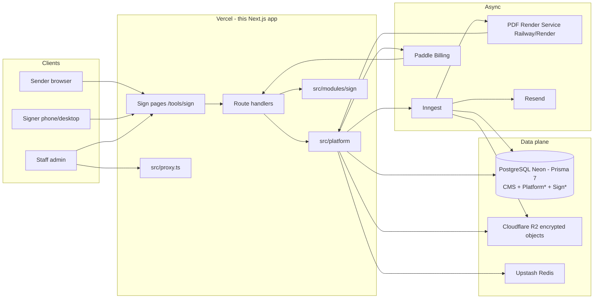
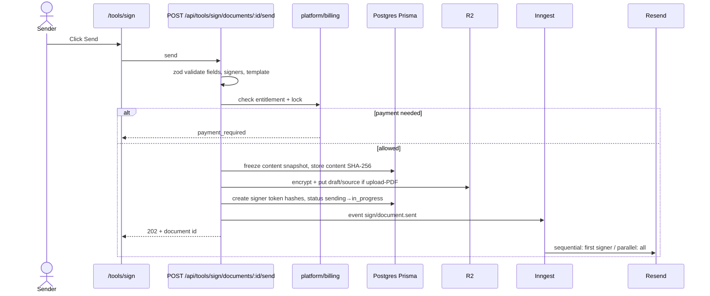
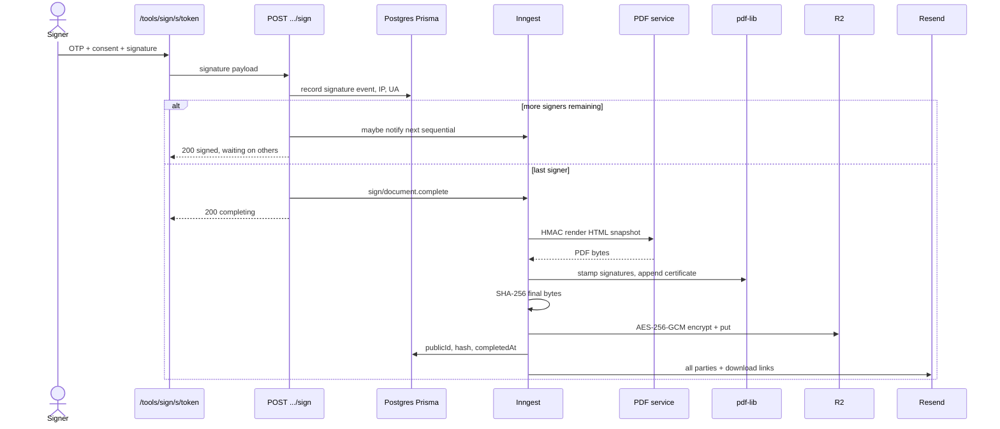

# Architecture — KarmaKoders Sign

Sign is a **self-contained module** inside this Next.js app (Vercel). Shared **platform** services are reused by future `/tools/*` products. CMS, free-tools, and SEO stay as they are.

Paths below are adapted to this repo: routes live under **`src/app`**, not a root `app/` directory. See [REPO_AUDIT.md](./REPO_AUDIT.md).

## 1. System context



**One database:** CMS tables and Sign/platform tables share **PostgreSQL (Neon) via Prisma 7** ([ADR 002](./adr/002-postgres-prisma.md)). Sign models are prefixed `Platform*` and `Sign*`. Sign domain code **never** references CMS `User`, `Membership`, `Tenant`, or `AuditLog`.

Request interception for `/admin/*` continues in **`src/proxy.ts`** (Next.js 16; there is no `middleware.ts`).

## 2. Folder plan (this repo)

```
src/platform/                 # shared by Sign and future paid tools
  db/                         # Prisma re-export / Sign+Platform query helpers
  auth/                       # OTP sessions (kk_session), token hashing — never getServerSession for customers
  billing/                    # wallet, entitlements, Paddle mapping
  email/                      # Resend + React Email templates
  storage/                    # R2 client + AES-256-GCM envelope (never UploadThing for Sign)
  audit/                      # append-only Sign evidence (Sign* tables, not CMS AuditLog)
  rate-limit/                 # Upstash Redis
  jobs/                       # Inngest client + event names
  logger/                     # structured logs + Sentry

src/modules/sign/
  templates/                  # template registry, fields, HTML
  documents/                  # document state machine
  signers/                    # tokens, order, OTP for signers
  pdf/                        # stamp/certificate via pdf-lib; HMAC client to render service
  signing/                    # consent, capture, decline, void
  ui/                         # Sign-only components (preview, pad, dashboard)

src/app/tools/page.tsx        # redirect → /tools/sign (reserve slug from CMS [slug])
src/app/tools/sign/           # pages — URL /tools/sign/...
src/app/api/tools/sign/       # Sign HTTP APIs
src/app/api/platform/auth/    # OTP for senders (NOT /api/auth — NextAuth catch-all)
src/app/api/billing/          # checkout, portal, wallet read
src/app/api/webhooks/paddle/  # Paddle webhooks (shared)
src/app/(admin)/admin/(dashboard)/sign/   # staff UI at /admin/sign
src/proxy.ts                  # Next.js 16 request interception (/admin/*, /login)
```

**Do not** add Sign domain code to `src/lib/tools/` (free-tools). **Do not** mount OTP under `src/app/api/auth/`. **Do not** store Sign PDFs in UploadThing.

## 3. Services

| Service | Role |
|---|---|
| **Vercel** | Next.js 16 App Router, Sign UI + APIs; `src/proxy.ts` for admin gate |
| **PostgreSQL (Neon) + Prisma 7** | CMS **and** Sign/platform. New models: `Platform*`, `Sign*`. Existing `DATABASE_URL`. |
| **Cloudflare R2** | Private bucket. Objects encrypted with **AES-256-GCM** before PUT. Never UploadThing for Sign. |
| **Upstash Redis** | `src/platform/rate-limit` — OTP and signing-link limits; short-lived locks at send |
| **Inngest** | Emails, reminders, expiry, PDF generation, webhook retries |
| **PDF Render Service** | Docker + Puppeteer on Railway or Render. HTTPS + HMAC (`PDF_SERVICE_SECRET`). HTML → PDF bytes. |
| **pdf-lib** | Stamp signatures, append certificate page, in-app (Vercel/Inngest) when possible |
| **Resend + React Email** | Transactional email |
| **Paddle Billing** | Merchant of record; packs + subscriptions |
| **Sentry** | Errors |
| **PostHog** | Product analytics |
| **zod** | Request/response validation |

## 4. URL map

| URL | Audience | Notes |
|---|---|---|
| `/tools` | Public | `src/app/tools/page.tsx` **redirects to** `/tools/sign` |
| `/tools/sign` | Public | Landing |
| `/tools/sign/pricing` | Public | Plans from `plans.ts`, comparison, billing FAQ |
| `/tools/sign/templates` | Public / sender | Catalog |
| `/tools/sign/templates/[slug]` | Public / sender | Preview |
| `/tools/sign/login` | Sender | OTP start |
| `/tools/sign/dashboard` | Sender | List documents |
| `/tools/sign/new/[template]` | Sender | Compose |
| `/tools/sign/new/upload` | Sender | Upload your own PDF (separate flow, not a catalog template) |
| `/tools/sign/documents/[id]` | Sender | Status, remind, void, download |
| `/tools/sign/billing` | Sender | Credits, plans, invoices via Paddle |
| `/tools/sign/s/[token]` | Signer | No account |
| `/tools/sign/verify/[publicId]` | Public | Verification |
| `/legal/terms`, `/legal/privacy`, `/legal/refund-policy`, `/legal/esign-disclosure`, `/legal/acceptable-use` | Public | Sign policies (drafts pending lawyer review). The CMS `/privacy`, `/terms`, `/refund-policy` and `/contact` stay for the agency site. |
| `/admin/sign` | Staff | NextAuth + permission **`sign:admin`** |
| `/admin` | Staff | **Existing CMS** — do not replace |

### API map

| URL | Role |
|---|---|
| `/api/platform/auth/*` | Customer OTP request/verify/logout |
| `/api/tools/sign/*` | Documents, signers, signing, verify |
| `/api/billing/*` | Entitlement, Paddle checkout session |
| `/api/webhooks/paddle` | Paddle events |
| `/api/auth/[...nextauth]` | **Unchanged CMS login** |

## 5. Auth model

| Actor | Mechanism |
|---|---|
| Sender (customer) | Email OTP via `/api/platform/auth/*` → httpOnly cookie **`kk_session`**. Helpers live in **`src/platform/auth`**. **Never** call `getServerSession` for customers. |
| Signer | Unpredictable `token` in URL + email OTP + consent checkbox |
| Staff | Existing NextAuth credentials + permission **`sign:admin`**. Pages at `/admin/sign`. Gated by `src/proxy.ts` like other admin routes. |

Hash signer tokens with `TOKEN_PEPPER` (HMAC-SHA256); store only the hash. Raw tokens appear once in email links.

`kk_session` must not share the NextAuth cookie name (`next-auth.session-token`).

## 6. Document state machine

Statuses mirror the `SignDocumentStatus` enum (`prisma/schema.prisma`) and `src/platform/db/sign-status.ts`.

```
DRAFT → SENT → PARTIALLY_SIGNED → COMPLETED
DRAFT → VOIDED
SENT | PARTIALLY_SIGNED → COMPLETED | DECLINED | EXPIRED | VOIDED
COMPLETED, DECLINED, EXPIRED, VOIDED are terminal.
```

There is no `sending` status. The brief send phase (entitlement check, charge, signer token creation, `sign/document.sent` enqueue) runs under a lock — Upstash Redis + one Postgres transaction (§7) — and commits as a single `DRAFT → SENT` transition. Signers never see `DRAFT`. `PARTIALLY_SIGNED` means at least one, but not every, signer has signed. Per-signer "sent" and "expired" (PRD S5) are derived from `sentAt`, signing order and the document status.

Database tables, protections and retention: [DATABASE.md](./DATABASE.md).

## 7. Entitlement at send

Order of use:

1. Free: remaining sends this **calendar month** (UTC) if signer count ≤ 2
2. Else Sign Pro or All Access subscription (Paddle status active)
3. Else credits (`platform_customers.credits_balance`, changed only with an append-only `platform_credit_ledger` row; 1 credit = 1 send)
4. Else return `payment_required` with Paddle price IDs

Lock (Upstash Redis + Postgres transaction on `Platform*` / `Sign*` rows) so double-click cannot send twice.

Credits never expire and are **global to the sender’s KarmaKoders tool wallet**, not Sign-only.

## 8. Flow — Send



**In-request work stays small.** Email and any HTML render happen in Inngest.

## 9. Flow — Final signature



If Puppeteer is only needed for HTML templates, upload-PDF may skip the render service and stamp with pdf-lib only. The HMAC Docker + Puppeteer service remains mandatory for HTML templates.

## 10. Security notes

- R2 bucket: public access **blocked**. Downloads via short-lived signed URLs or authenticated proxy. **Never UploadThing for Sign files.**
- `FILE_ENCRYPTION_KEY`: 32-byte key material; rotate with envelope version field on objects.
- OTP: 6 digits, 10-minute TTL, Upstash throttle per email + IP (`src/platform/rate-limit`).
- Paddle webhook: verify `PADDLE_WEBHOOK_SECRET`; handlers idempotent on `event_id`.
- PDF service: reject requests whose HMAC does not match body + timestamp (skew ≤ 5 minutes).
- Verification page: rate-limit; no listing endpoint.
- Customers: `kk_session` + `src/platform/auth` only — never `getServerSession`.

## 11. Observability

- Sentry: Next.js + PDF service.
- PostHog: PRD events; no PII in event properties beyond hashed email if required.
- Logger: request id from existing patterns; Sign jobs log `documentId`, never raw OTP.

## 12. Testing later tasks should add

- Unit: entitlement math, state machine, token hashing.
- Integration: send lock, Paddle webhook idempotency, OTP rate limit (use test Neon or Prisma test DB — never production).
- Contract: PDF service HMAC.
