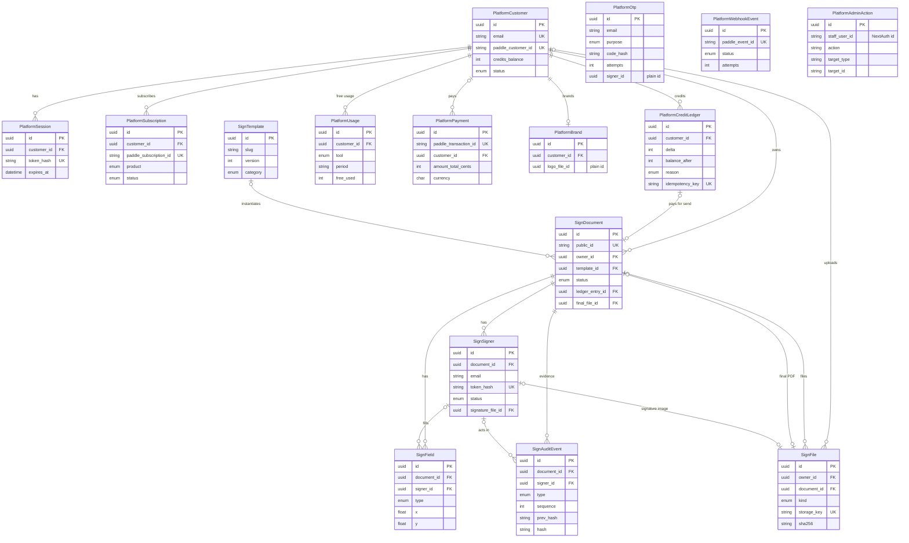

# Database — KarmaKoders Platform and Sign

PostgreSQL (Neon) via Prisma 7, shared with the CMS (see [ADR 002](./adr/002-postgres-prisma.md)). This document covers only the **Platform** (shared paid-tools) and **Sign** tables. CMS tables are unchanged and are never referenced by these models.

- Schema: `prisma/schema.prisma`, sections `PLATFORM` and `SIGN` at the end of the file.
- Migrations:
  - `20261004090000_platform_sign_schema`: create-only (no DROP statements), Prisma-generated.
  - `20261004090100_platform_sign_db_protections`: CHECK constraints and append-only triggers (hand-written).
  - `20261007090000_sign_early_access`: create-only, adds `sign_early_access`.
- Append-only design: [ADR 010](./adr/010-append-only-ledger-and-audit.md).
- Environments: **local development and tests both use `.env.local`, whose `DATABASE_URL` points to the Neon dev branch** (created from Neon main, so it has the same migration history as production). CI uses a `postgres:16` service container. There is no separate test-database variable. See [ENV.md](./ENV.md).
- Connections: the app runtime and integration tests use the **pooled** `DATABASE_URL`. Prisma CLI commands (`migrate deploy` / `migrate status`) use the **direct** `DIRECT_URL` when set, otherwise `DATABASE_URL` (`prisma.config.ts`), because migrations need session-level locks that the pooler doesn't support.

## Conventions

| Rule | How |
|---|---|
| Ids | UUID v7 (`@default(uuid(7)) @db.Uuid`), generated by Prisma Client. They're time-ordered, so B-tree inserts stay local. **The database has no default:** raw SQL inserts must supply an id. |
| Naming | snake_case tables and columns via `@@map` / `@map` (`platform_customers.credits_balance`). Postgres enum types are snake_case too (`sign_document_status`). |
| Timestamps | `created_at` on every table. `updated_at` (`@updatedAt`) on every mutable table. Append-only tables have no `updated_at`. |
| Money | Integer cents (`amount_total_cents`) plus `currency CHAR(3)` (ISO 4217). Never floats. |
| Credits | Integers. `platform_customers.credits_balance` is a cached balance; the ledger is the source of truth. |
| Emails | Stored lowercase and trimmed. Normalised in app code by `emailSchema` (`src/platform/auth/schemas.ts`); uniqueness applies to the stored value. |
| Status and type fields | Explicit Postgres enums. Free-form strings only where the brief says so (`role`, `reference_type`, admin `action` / `target_type`). |
| Deletes | Soft delete (`deleted_at`) for customers, documents and files. Money and evidence rows are never hard-deleted (see protections). |
| Boundaries | Platform never references Sign tables (plain id columns `platform_otps.signer_id` and `platform_brands.logo_file_id`). Sign references Platform with real foreign keys. No foreign keys to CMS tables; `staff_user_id` / `created_by_staff_id` hold NextAuth user ids as plain strings. |

## Entities

### Platform

| Model / table | Purpose |
|---|---|
| `PlatformCustomer` / `platform_customers` | A paying-tool customer (sender). Holds the email, the Paddle customer id, the cached credit balance, `ACTIVE`/`SUSPENDED` status, last login and soft delete. Independent of the CMS `User`. |
| `PlatformSession` / `platform_sessions` | `kk_session` login sessions. Only the HMAC of the cookie value is stored, with expiry, last seen, ip, user agent and revocation. |
| `PlatformOtp` / `platform_otps` | Email OTP challenges for sender `LOGIN` or `SIGNER` verification. Stores the code HMAC, attempts, expiry, consumption, the optional signer id and ip. |
| `PlatformSubscription` / `platform_subscriptions` | Mirror of a Paddle subscription (Sign Pro / All Access, month or year, status, period, scheduled change). |
| `PlatformCreditLedger` / `platform_credit_ledger` | **Append-only.** Every credit change, with delta, resulting balance, reason, tool, reference, Paddle transaction and a unique idempotency key. |
| `PlatformUsage` / `platform_usage` | Free-tier counter per customer, per tool, per UTC month (`YYYY-MM`). |
| `PlatformPayment` / `platform_payments` | Paddle transactions (packs and subscription charges): status, price ids, total in cents, currency, credits granted. |
| `PlatformWebhookEvent` / `platform_webhook_events` | Idempotent Paddle webhook inbox keyed by the Paddle event id. Tracks processing status, attempts and the last error for admin retry. |
| `PlatformBrand` / `platform_brands` | A sender's default branding: company name, logo file and primary colour. |
| `PlatformAdminAction` / `platform_admin_actions` | **Append-only.** Staff support actions with before/after snapshots. |

### Sign

| Model / table | Purpose |
|---|---|
| `SignTemplate` / `sign_templates` | Versioned template body (HTML, field schema, signer roles). Unique on (`slug`, `version`). Slugs are canonical in `src/modules/sign/templates/catalog.ts`. |
| `SignDocument` / `sign_documents` | A document to be signed. Holds the public id (`KKS-YYYY-XXXXXX`), owner, template or upload source, status, field values, frozen HTML and its hash, signing order, expiry, branding snapshot, how the send was paid for, the final file and its hash, an optimistic-lock version and soft delete. |
| `SignSigner` / `sign_signers` | A signer on a document. Holds the link-token HMAC, status, OTP, consent, view/sign/decline timestamps, signature method and file, and reminders. |
| `SignField` / `sign_fields` | A placed field (signature, initials, date, text, checkbox). Coordinates are fractions of the page. |
| `SignFile` / `sign_files` | Metadata for an encrypted object in private R2 (storage key, MIME type, size, SHA-256). The bytes never go into Postgres. |
| `SignEarlyAccess` / `sign_early_access` | Landing-page early-access signups: unique lowercase email, optional company, role and source. Stand-alone, with no relations. **Never truncated by integration tests**: it may hold real signups. |
| `SignAuditEvent` / `sign_audit_events` | **Append-only**, hash-chained e-sign evidence: a gap-free `sequence` per document, `prev_hash` and `hash`. |

## ER diagram

`PlatformWebhookEvent` and `PlatformAdminAction` have no foreign keys. `PlatformOtp.signer_id` and `PlatformBrand.logo_file_id` are plain ids.

## Database-level protections

These hold even if application code has a bug or someone runs SQL by hand. They're defined in `20261004090100_platform_sign_db_protections`.

| Protection | Why |
|---|---|
| `CHECK platform_customers.credits_balance >= 0` | No one can spend credits they don't have. The balance is updated in the same transaction as the ledger insert, so a negative result aborts the whole spend. |
| `CHECK platform_credit_ledger.delta <> 0` | A zero-delta row means nothing and would hide bugs, such as a spend of 0 that still links a document. |
| `CHECK platform_credit_ledger.balance_after >= 0` | The running balance recorded on each row must be valid on its own, so the ledger can be audited without the customer row. |
| `CHECK platform_usage.free_used >= 0` | A negative counter would quietly grant extra free sends. |
| `CHECK platform_payments.amount_total_cents >= 0` | Totals are non-negative integer cents. Refunds and chargebacks are statuses, not negative rows. |
| `CHECK sign_fields.x, y, width, height BETWEEN 0 AND 1` | Coordinates are page fractions. Anything outside 0..1 would put a field off the page on the final PDF. |
| Trigger `kk_forbid_mutation` BEFORE UPDATE OR DELETE on `sign_audit_events` | The audit trail is hash-chained evidence; editing or deleting one event breaks the tamper-evident certificate. |
| Same trigger on `platform_credit_ledger` | Every credit change is a new row, and corrections are compensating entries, so balances can always be rebuilt and audited. |
| Same trigger on `platform_admin_actions` | Staff must not be able to edit the record of their own support actions. |
| BEFORE TRUNCATE (statement-level) on the same three tables | TRUNCATE skips row triggers. Without this the append-only guarantee would have a hole. |
| `UNIQUE platform_credit_ledger.idempotency_key` | A retried webhook or a double-clicked send can't grant or spend credits twice. |
| `UNIQUE platform_webhook_events.paddle_event_id`, `platform_payments.paddle_transaction_id`, `platform_subscriptions.paddle_subscription_id` | Paddle webhooks are at-least-once; these make every handler idempotent. |
| `UNIQUE sign_documents.ledger_entry_id` | One ledger entry pays for at most one document. |
| `UNIQUE sign_audit_events (document_id, sequence)` | The audit chain per document has no duplicates; two concurrent writers can't both claim the same position. |
| `UNIQUE sign_signers (document_id, email)` and `token_hash` | One signer row per email per document; token lookups are unambiguous. |
| `ON DELETE RESTRICT` from ledger, payments, documents, files and audit events | A cascade from a customer or document hard delete would either destroy evidence or hit the append-only trigger. The lifecycle is soft delete. |

The trigger raises SQLSTATE `23001` (`restrict_violation`) with the message `<table> is append-only: <op> is not allowed`. `src/platform/db/db-protections.integration.test.ts` proves every rule above against `DATABASE_URL` (the Neon dev branch locally, the postgres service container in CI). The suite resets `platform_*` / `sign_*` tables (never CMS tables, never `sign_early_access`) through `resetPlatformSignTables`, which disables the `*_no_truncate` guards only inside its own transaction.

## Indexes and the queries they serve

| Index | Query |
|---|---|
| `platform_customers.email` (unique) | Find the customer by email at OTP verify (upsert). |
| `platform_customers.paddle_customer_id` (unique) | Map a Paddle webhook to the customer. |
| `platform_sessions.token_hash` (unique) | Look up the session on every authenticated request. |
| `platform_sessions (customer_id)` | List or revoke a customer's sessions; admin view. |
| `platform_otps (email, purpose, expires_at)` | Find the newest open challenge at verify; invalidate old codes at request; purge expired rows. |
| `platform_subscriptions (customer_id, status)` | Entitlement check at send: does this customer have an active subscription? |
| `platform_credit_ledger (customer_id, created_at DESC)` | Billing page credit history; admin balance audit. |
| `platform_usage (customer_id, tool, period)` (unique) | Free-quota check and increment at send. |
| `platform_payments (customer_id, occurred_at DESC)` | Billing page payment history; admin payments list. |
| `platform_webhook_events (status, created_at)` | Admin failed-webhook list and retry job. |
| `platform_admin_actions (target_type, target_id)`, `(staff_user_id, created_at)` | History of a customer or document; actions by a staff member. |
| `sign_templates (slug, version)` (unique) | Load the latest active version of a template. |
| `sign_documents (owner_id, status, created_at DESC)` | Sender dashboard, filtered by status, newest first. |
| `sign_documents (status, expires_at)` | Expiry job: open documents past `expires_at`. |
| `sign_documents.public_id` (unique) | Public verification page `/tools/sign/verify/[publicId]`. |
| `sign_signers.token_hash` (unique) | Signer link `/tools/sign/s/[token]`. |
| `sign_signers (document_id, order)` | Sequential signing: find the current and next signer. |
| `sign_fields (document_id)`, `(signer_id)` | Load fields for rendering; fields assigned to a signer. |
| `sign_files.storage_key` (unique), `(document_id, kind)`, `(owner_id)` | Resolve an R2 object; find a document's original or final file; a customer's uploads. |
| `sign_audit_events (document_id, occurred_at)` | Audit certificate and document timeline. |
| `sign_early_access.email` (unique) | Idempotent signup: `createMany` with `skipDuplicates`, so a repeat email is a no-op. |

## Retention

| Data | Rule |
|---|---|
| Signed documents, their files and audit events | Kept **7 years** unless the owner deletes the document. An owner delete sets `deleted_at` (and `sign_files.deleted_at`); R2 objects and rows are purged by a later job. |
| Audit events, credit ledger, admin actions | Append-only, with no delete path today. Purging them after retention needs a reviewed migration that temporarily disables the trigger for a single, logged job ([ADR 010](./adr/010-append-only-ledger-and-audit.md)). |
| OTPs (`platform_otps`) | Purged by a job added later (consumed or expired rows older than a short window). |
| Expired and revoked sessions | Purged by a job added later. |
| Early-access signups | Kept until launch outreach is done; delete on request (privacy). Never touched by test resets. |
| Webhook payloads | Kept for admin retry and support. Retention to be set with the purge job. |
